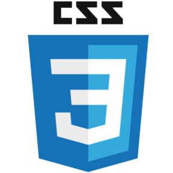

# Sambantham P

<h1 align="center">Hi 👋, I'm Sambantham - P</h1>

  

- 🌱 I’m currently learning  React 

- 👨‍💻 All of my projects are available at [https://github.com/sambantham-p](https://github.com/sambantham-p)

- 📫 How to reach me : **sambantham0901@gmail.com**

# 📊 GitHub Stats:
 
 

---

### SkillSet🎓
                                    
| | **Tools** |
| --- | --- |
| **Languages** |  |
| **FrontEnd** |  |
| **Databases** |  |
**Frameworks** |  |
**Libraries** |  |
**Cloud Services** |  |
**Platforms** |  |

### Connect with me ♥️😼

